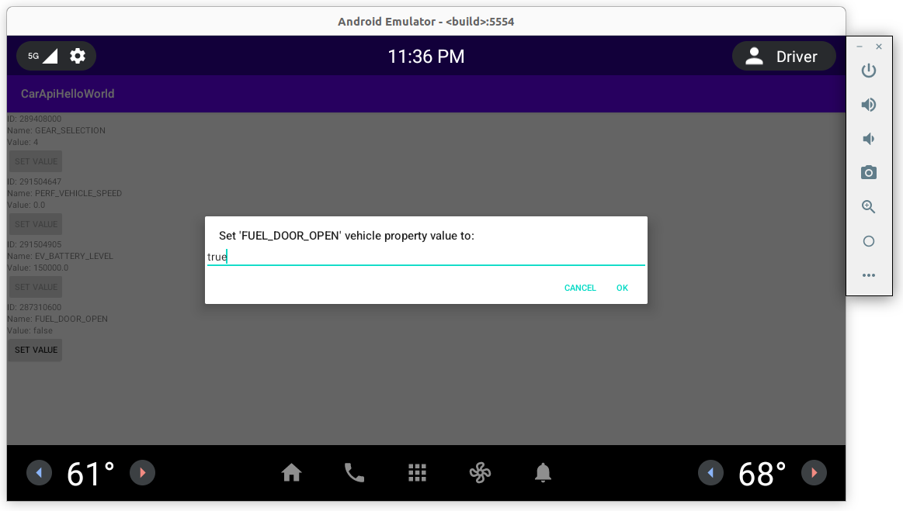

# car-api-hello-world
Android automotive CAR API usage example.

The example is based on the use of `android.car.hardware.CarPropertyManager` and shows how to work with `SYSTEM` (speed, transfer, etc.) and `VENDOR` custom properties that belong to all possible permission protection levels:
- normal
- dangerous
- signature|privileged

Project support both [gradle](app/build.gradle) and [AOSP (Android.bp)](Android.bp) builds. 




## CAR API usage
To use the CAR API, the following steps were taken:

1. Add `android.car` library (to [gradle](app/build.gradle), to [Android.bp](Android.bp)).

2. Add permissions to [AndroidManifest.xml](app/src/main/AndroidManifest.xml).

3. Request `dangerous` permissions in runtime in `onCreate()` in [MainActivity.java](app/src/main/java/com/example/carapihelloworld/MainActivity.java).

4. Use `CarPropertyManager` API in [MainActivity.java](app/src/main/java/com/example/carapihelloworld/MainActivity.java):
    - listeners: `registerCallback()`
    - getters: `getIntProperty()`
    - setters: `setBooleanProperty`

## Emulator/AVD
Tested on emulators:
- `Polestar2` ([Useful link of how to set up `Polestar2` on Android Studio](https://stackoverflow.com/questions/57968790/android-automotive-emulator-no-system-images-installed-for-this-target/58159715#58159715))
- AOSP `aosp_car_x86-userdebug` (android-12.0.0_r3)
- [NCAR - Android Automotive Emulator Project](https://github.com/nkh-lab/aosp-ncar-manifest) - is used for testing `VENDOR` properties

To change car speed, gear, location, etc. use `AVD Extended Controls`:


## How to run on AOSP
Start `CarApiHelloWorldApp` app via ADB ActivityManager:
```
$ am start -n com.example.carapihelloworld/.MainActivity
```

## Logcat expected output
After compiling and running this project, the following `logcat` messages are expected:
```
2022-02-14 17:29:18.154 4979-4979/com.example.carapihelloworld D/CarApiHelloWorld: Test CarPropertyManager getters:
2022-02-14 17:29:18.155 4979-4979/com.example.carapihelloworld D/CarApiHelloWorld: GEAR_SELECTION: getIntProperty(289408000, 0)=4
2022-02-14 17:29:18.156 4979-4979/com.example.carapihelloworld D/CarApiHelloWorld: VENDOR_TEST_COUNTER: getIntProperty(557842433, 0)=4
2022-02-14 17:29:18.156 4979-4979/com.example.carapihelloworld D/CarApiHelloWorld: Test CarPropertyManager callbacks:
2022-02-14 17:29:18.282 4979-4979/com.example.carapihelloworld D/CarApiHelloWorld: GEAR_SELECTION: onChangeEvent(4)
2022-02-14 17:29:18.282 4979-4979/com.example.carapihelloworld D/CarApiHelloWorld: PERF_VEHICLE_SPEED: onChangeEvent(0.0)
2022-02-14 17:29:18.282 4979-4979/com.example.carapihelloworld D/CarApiHelloWorld: EV_BATTERY_LEVEL: onChangeEvent(150000.0)
2022-02-14 17:29:18.283 4979-4979/com.example.carapihelloworld D/CarApiHelloWorld: FUEL_DOOR_OPEN: onChangeEvent(false)
2022-02-14 17:29:18.283 4979-4979/com.example.carapihelloworld D/CarApiHelloWorld: VENDOR_TEST_COUNTER: onChangeEvent(4)
```
Permission errors examples:
```
2021-11-01 03:16:36.840 26840-26840/com.example.carapihelloworld E/CarApiHelloWorld: FUEL_DOOR_OPEN: setBooleanProperty(), Exception: permission is null
```
```
2021-11-02 13:13:55.293 2642-2642/com.example.carapihelloworld E/CarApiHelloWorld: FUEL_DOOR_OPEN: setBooleanProperty(), Exception: requires android.car.permission.CONTROL_CAR_ENERGY_PORTS
```
