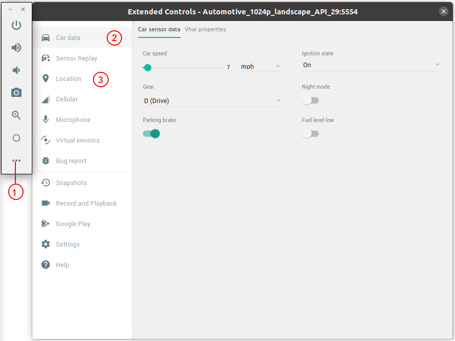

# car-api-hello-world
Android automotive CAR API usage example.

Example based on `android.car.hardware.CarSensorManager`(deprecated in API 29) and `android.car.hardware.CarPropertyManager` usage for obtaining speed and gear changing events.

## CAR API usage
In this project for using CAR API the following steps were done:

1. Added `android.car` library to [app/build.gradle](app/build.gradle):
```
android {
    ...
    useLibrary 'android.car'
}
```
2. Added permissions to [AndroidManifest.xml](app/src/main/AndroidManifest.xml):
```
<uses-permission android:name="android.car.permission.CAR_SPEED" />
<uses-permission android:name="android.car.permission.CAR_POWERTRAIN" />
```
3. Added listeners to `android.car.hardware.CarSensorManager` in [MainActivity.java](app/src/main/java/com/example/carapihelloworld/MainActivity.java)

## Emulator/AVD
For runtime testing `Polestar2` AVD is used.

[Useful link of how to set up `Polestar2` on Android Studio.](https://stackoverflow.com/questions/57968790/android-automotive-emulator-no-system-images-installed-for-this-target/58159715#58159715)

## Logcat expected output
After compiling and running this project, the following logcat messages are expected:  
```
...
2020-10-06 16:19:44.610 25580-25580/com.example.carapihelloworld D/MainActivity: CarPropertyManager.CurrentGear: 8
2020-10-06 16:19:44.623 25580-25580/com.example.carapihelloworld D/MainActivity: CarSensorManager.onSpeedChanged: 1.9444445
2020-10-06 16:19:44.623 25580-25580/com.example.carapihelloworld D/MainActivity: CarSensorManager.onGearChanged: 8
2020-10-06 16:19:44.624 25580-25580/com.example.carapihelloworld D/MainActivity: CarPropertyManager.onGearChanged: 8
2020-10-06 16:19:44.624 25580-25580/com.example.carapihelloworld D/MainActivity: CarPropertyManager.onSpeedChanged: 1.9444445
...
2020-10-06 16:20:42.973 25580-25580/com.example.carapihelloworld D/MainActivity: CarPropertyManager.onGearChanged: 4
2020-10-06 16:20:42.973 25580-25580/com.example.carapihelloworld D/MainActivity: CarSensorManager.onGearChanged: 4
2020-10-06 16:20:50.085 25580-25580/com.example.carapihelloworld D/MainActivity: CarPropertyManager.onGearChanged: 1
2020-10-06 16:20:50.086 25580-25580/com.example.carapihelloworld D/MainActivity: CarSensorManager.onGearChanged: 1
...
2020-10-06 16:23:10.680 25580-25580/com.example.carapihelloworld D/MainActivity: CarPropertyManager.onSpeedChanged: 4.7222223
2020-10-06 16:23:10.681 25580-25580/com.example.carapihelloworld D/MainActivity: CarSensorManager.onSpeedChanged: 4.7222223
2020-10-06 16:23:11.204 25580-25580/com.example.carapihelloworld D/MainActivity: CarPropertyManager.onSpeedChanged: 6.1111116
2020-10-06 16:23:11.206 25580-25580/com.example.carapihelloworld D/MainActivity: CarSensorManager.onSpeedChanged: 6.1111116
...
```
To change car speed, gear, location, etc. use `AVD Extended Controls`:


